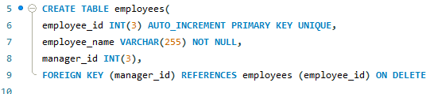
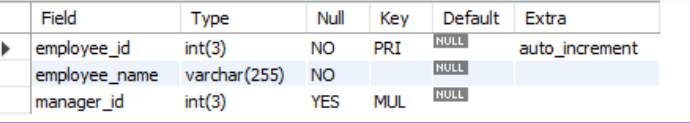
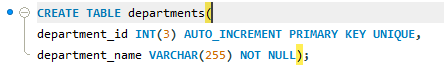
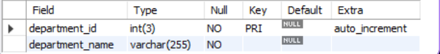
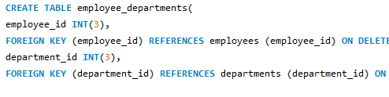
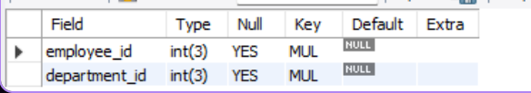
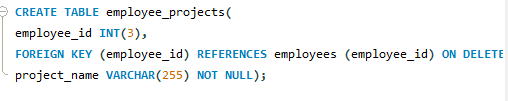
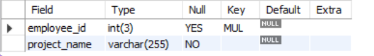
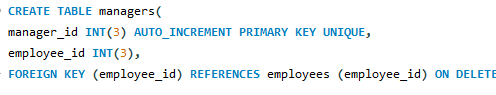
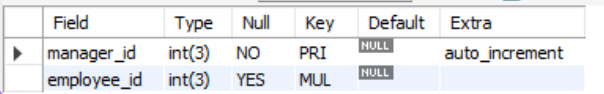

## Lab Task 2 - MySQL Basics
# Task 1 - Employee Table
employee id: Unique INT, Auto Increment, PK.
employee name: VARCHAR(255), not null
manager id: INT, FK referencing employee id.

# Code: 

# Table:

# Task 2 - Departments Table
department id: Unique INT, Auto Increment, PK.
department name: VARCHAR(255), not null.

# Code:

# Table:

# Task 3 - Employee Departments
employee id: INT, FK referencing employee id.
department id: INT, FK referencing department id

# Code:

# Table:

# Task 4 - Employee Projects
employee id: INT, FK referencing employee id.
project name: VARCHAR(255), not null.

# Code:

# Table:

# Task 5 - Managers
manager id: Unique INT, Auto Increment, PK.
employee id: INT, FK referencing employee id.

# Code:

# Table:

