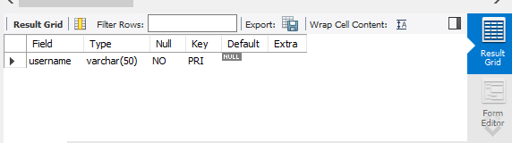
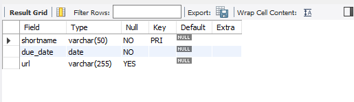
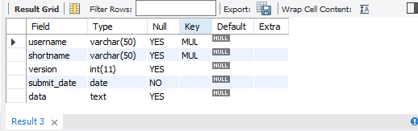

## Lab Task 2 - TRANSFORMING ER MODEL into Relational Tables

# Task 1 - Student Table

create table student (
username VARCHAR(50) PRIMARY KEY
);

# OUTPUT:

# Task 2 - Assignment Table

create table assignment (
shortname VARCHAR(50) PRIMARY KEY,
due_date DATE NOT NULL,
url VARCHAR(255)
);

# OUTPUT:

# Task 3 - Submission Table

create table submission (
username VARCHAR(50),
shortname VARCHAR(50),
version INT,
submit_date DATE NOT NULL,
data TEXT,
FOREIGN KEY (username) REFERENCES student (username),
FOREIGN KEY (shortname) REFERENCES assignment (shortname)
);

# OUTPUT:

# Task 4 - Relational Table

# OUTPUT:

