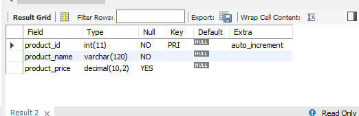
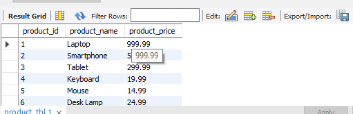

## Lab Task 3 - TABLE MANIPULATION

# Task 1

CREATE TABLE product_tbl (
product_id INT AUTO_INCREMENT PRIMARY KEY,
product_name VARCHAR(100) NOT NULL,
product_price DECIMAL(10, 2),
CHECK (product_price > 0)
);

# OUTPUT:

# Task 2

CHECK (product_price > 0)

# Task 3

INSERT INTO product_tbl (product_name, product_price)
VALUES ("Laptop",999.99), ("Smartphone",599.99), 
("Tablet",299.99), ("Keyboard",19.99), ("Mouse",14.99),
("Desk Lamp",24.99), ("Speakers",9.99);

# OUTPUT:

# Task 4 

ALTER TABLE product_tbl 
MODIFY product_name VARCHAR(120) NOT NULL;

