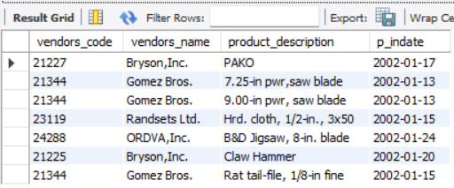
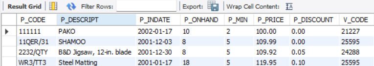
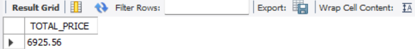
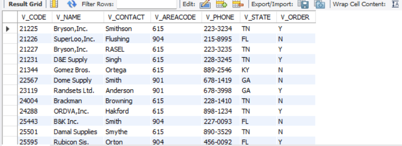
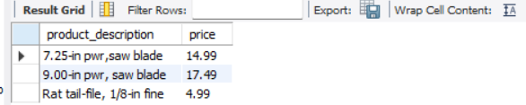

## Lab Task 5 - Using SQL views and Stored Procedures and Stored Functions.

# Task 1
CREATE A VIEW that will display the vendors_code, vendors name, product description p_indate, of all products with p_indate from 2002 onwards

# Code
CREATE VIEW products_2002_onwards AS
SELECT V.V_CODE AS vendors_code, V.V_NAME AS vendors_name, P.P_DESCRIPT AS product_description, P.P_INDATE AS p_indate FROM products P 
JOIN vendors V ON P.V_CODE = V.V_CODE WHERE P.P_INDATE >= '2002-01-01';

SELECT * FROM products_2002_onwards;

# Output:

# Task 2
CREATE a VIEW that will display all products whose price range is between 100-150

# Code
CREATE VIEW products_range AS 
SELECT * FROM Products WHERE P_PRICE BETWEEN 100 AND 150;

SELECT * FROM products_range;

# Output:

# Task 3
Create a VIEW that will COMPUTE for the (TOTAL_PRICE) of ALL PRODUCTS by getting the (P_ONHAND x P_PRICE) Sold by vendors with the following v_code (21344, 23119 and 24288)

# Code
CREATE VIEW total_price_by_vendors AS
SELECT SUM(P_ONHAND * P_PRICE) AS TOTAL_PRICE FROM products
WHERE V_CODE IN (21344, 23119, 24288);

SELECT * FROM total_price_by_vendors;

# Output:

# Task 4
CREATE a STORED PROCEDURE that WILL take a SINGLE PARAMETER and UPDATED the Name of Vendor ‘Bryson,Inc. ’ to ‘Bryson and Co’.

# Code
DELIMITER //
CREATE PROCEDURE UpdateVendorName()
BEGIN
UPDATE vendors SET V_NAME = 'Bryson and Co'
WHERE V_NAME = 'Bryson, Inc.';
END //
DELIMITER ;

SELECT * FROM vendors;

# Output:

# Task 5
CREATE A Function that will take 2 parameters(v_code and v_state) and display All the product description and price based on the parameters passed to the function

# Code
DELIMITER //
CREATE PROCEDURE GetProdByVendorAndState(IN V_CODE INT, IN V_STATE VARCHAR(3))
BEGIN
SELECT P.P_DESCRIPT AS product_description,
P.P_PRICE AS price FROM products P
JOIN vendors V ON P.V_CODE = V.V_CODE
WHERE V.V_CODE = v_code AND V.V_STATE = v_state;
END // 
DELIMITER ;

CALL GetProdByVendorAndState(21344, 'KY');

# Output:

